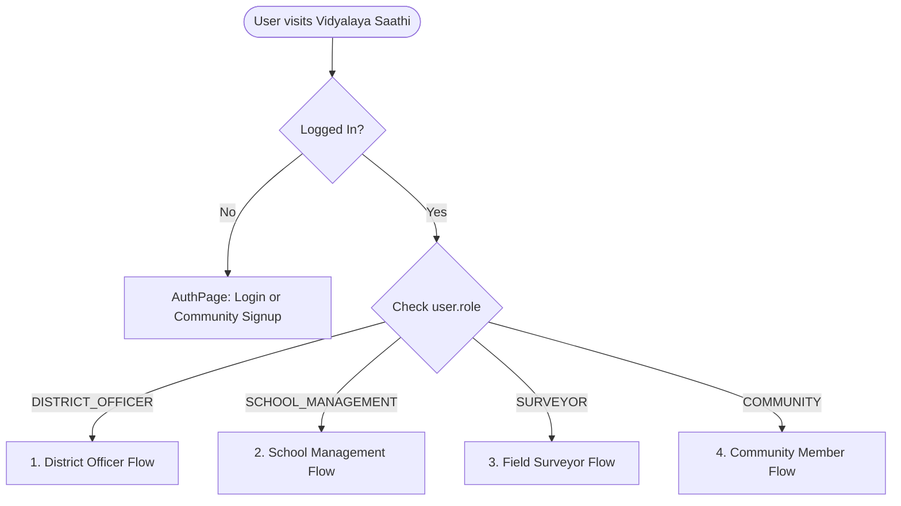
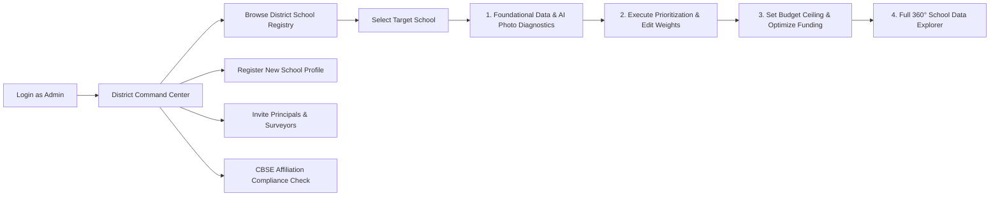
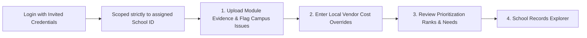
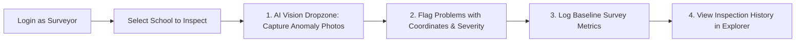
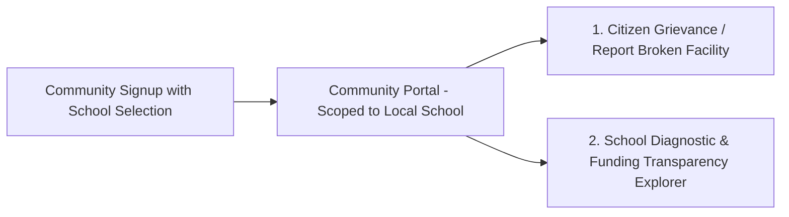

# Vidyalaya Saathi — System Architecture & Role-Based Workflows

Vidyalaya Saathi is an intelligent diagnostic and capital allocation engine designed for government school infrastructure and educational outcomes. It bridges on-the-ground physical reality (via AI computer vision and citizen grievance reporting) with deterministic prioritization and mathematical budget optimization.

---

## 1. Core System Philosophy

```
┌─────────────────┐       ┌─────────────────┐       ┌───────────────────────┐
│  Data Evidence  │  ──>  │  AI Perception  │  ──>  │ Deterministic Logic   │
│ (Survey/Images) │       │ (Vision Models) │       │ (Prioritize & Budget) │
└─────────────────┘       └─────────────────┘       └───────────────────────┘
```

1. **Separation of Perception & Decision**: AI vision models detect and classify physical defects (e.g., broken desks, water leakage, cracked boundary walls). AI *never* decides budgets or final scores.
2. **Explainable Scoring Engine**: Prioritizes open issues using a transparent multi-factor weighted algorithm (Severity, Impact, Reach, Urgency, Data Confidence, School Context).
3. **Knapsack Budget Optimization**: Computes highest-ROI interventions under fixed capital ceilings, guaranteeing that safety-critical problems are funded first.
4. **Role-Based Access Control (RBAC)**: Enforces distinct views, capabilities, and data isolation for 4 specialized user groups.

---

## 2. The 4 User Groups & Permission Matrix

| Feature / Action | `DISTRICT_OFFICER` (Admin) | `SCHOOL_MANAGEMENT` (Principal) | `SURVEYOR` (Inspector) | `COMMUNITY` (Citizen/Student) |
| :--- | :---: | :---: | :---: | :---: |
| **System Scope** | Global (All Schools) | Single Assigned School | Global (Field Inspections) | Single Local School |
| **Authentication Mode** | Pre-seeded / Invited | Invited by District Officer | Invited by District Officer | Open Community Signup |
| **School Directory & Switching** | Full Access | ❌ Locked to `school_id` | Full Access | ❌ Locked to `school_id` |
| **Register New School Profile** | Yes (`POST /school-data/schools`) | ❌ | ❌ | ❌ |
| **AI Vision Photo Uploads** | Yes (All Modules) | Yes (Assigned School) | Yes (Field Audits) | ❌ |
| **Manual Problem Flagging** | Yes | Yes | Yes (w/ GPS Coordinates) | Yes (Grievance Form) |
| **AI Prioritization Engine** | Execute & Adjust Weights | View Ranked Breakdown | View Ranked Breakdown | ❌ |
| **Budget Optimizer Execution** | Full Access (Set Ceilings) | ❌ | ❌ | ❌ |
| **Cost Overrides (Vendor Quotes)** | Yes | Yes (Submit Local Quotes) | ❌ | ❌ |
| **CBSE Affiliation Tool** | Yes | ❌ | ❌ | ❌ |
| **User Provisioning / Invites** | Yes (`/auth/invite`) | ❌ | ❌ | ❌ |
| **Data Explorer (Read-only)** | Full District Audit | Assigned School Audit | Target School Audit | Public Transparency View |

---

## 3. End-to-End User Workflows



---

### Workflow 1: District Officer (`DISTRICT_OFFICER`)
**Target User**: District Education Officers, System Administrators.  
**Purpose**: Macro-level administration, policy compliance, resource allocation, and user management.



1. **Entry**: Logs in with official administrative credentials (`admin@vidyalaya.gov.in`).
2. **Top Navigation**:
   - `[District Dashboard]`: Overview of all registered schools.
   - `[CBSE Affiliation Tool]`: Verifies safety certificates, land area, pupil-teacher ratios, and mandatory infrastructure requirements.
   - `[+ Invite User]`: Modal to provision accounts for Surveyors or School Principals.
3. **School Selection**:
   - Chooses an existing school from the interactive directory grid (with problem, prioritization, and funding status badges) or registers a new school profile.
4. **Guided 4-Step Diagnostic Pipeline**:
   - **Step 1 (Data & Problems)**: Updates basic metrics, uploads photos to AI Vision modules, and flags problems.
   - **Step 2 (AI Prioritize)**: Executes scoring engine and inspects sub-score breakdown (Severity, Urgency, Reach, Impact).
   - **Step 3 (Budget Plan)**: Enters budget ceiling (e.g., ₹5,00,000), applies cost overrides, and runs the optimizer to calculate funded vs unfunded items.
   - **Step 4 (Data Explorer)**: Complete read-only audit of all raw and computed records.

---

### Workflow 2: School Management (`SCHOOL_MANAGEMENT`)
**Target User**: School Principals, Headmasters, School Development Committees.  
**Purpose**: On-campus problem reporting, updating local contractor quotes, and tracking resolution status.



1. **Entry**: Logs in with account provisioned by District Officer.
2. **Automatic Isolation**: The system locks `activeSchoolId` to `user.school_id`. No other schools can be accessed.
3. **Management Dashboard**:
   - **Step 1 (Evidence & Problems)**: Uploads photos of FLN progress, teacher attendance, or infrastructure defects for AI analysis; flags repair needs.
   - **Step 2 (Local Cost Overrides)**: Submits real contractor estimates or market repair costs for flagged problems.
   - **Step 3 (Prioritization Status)**: Views AI-ranked urgency of open issues at the school.
   - **Step 4 (Records Explorer)**: Full audit of student attendance, teacher workload snapshots, and defect resolutions.

---

### Workflow 3: Field Surveyor (`SURVEYOR`)
**Target User**: Field Engineers, Quality Monitors, Inspection Officers.  
**Purpose**: Physical on-site audits, photo evidence collection, and survey logging.



1. **Entry**: Logs in with surveyor credentials.
2. **Inspection Selection**: Selects any school in the district from the inspection registry.
3. **On-Site Inspection Flow**:
   - **Step 1 (AI Photo Scans)**: Captures dropzone photos of classrooms, toilets, drinking water facilities, and playgrounds.
   - **Step 2 (Observation Flagging)**: Flags detailed defects with image coordinate mapping, human condition notes, and severity ratings.
   - **Step 3 (Survey Metrics)**: Logs student enrollment and classroom counts.
   - **Step 4 (Explorer)**: Confirms data persistence and historical records.

---

### Workflow 4: Community Member (`COMMUNITY`)
**Target User**: Students, Parents, Teachers, Local Community Members.  
**Purpose**: Citizen grievance reporting and public transparency into government school maintenance and funding.



1. **Entry**: Self-registers via the **Community Signup** tab, picking their school from the dropdown.
2. **Community Portal**:
   - **Step 1 (Submit Grievance)**: Simple form to report broken furniture, hygiene hazards, damaged boundaries, or drinking water issues.
   - **Step 2 (Transparency Explorer)**: Public view showing what problems have been logged, their priority scores, and whether repairs have been funded.

---

## 4. Technical Architecture

### Backend Stack
- **Framework**: FastAPI (Python 3.13)
- **Database**: SQLite / PostgreSQL with SQLAlchemy (AsyncSession & aiosqlite/asyncpg)
- **Security**: OAuth2 Password Bearer with JWT (`python-jose`) and Bcrypt password hashing (`passlib`)
- **AI Vision Provider**: NVIDIA NIM API (`minimaxai/minimax-m3`) with fallback to local Ollama (`moondream`)

### Frontend Stack
- **Framework**: React 19 + TypeScript + Vite
- **State & Auth**: `AuthContext` (JWT in localStorage, automated `Bearer` header injection)
- **Styling**: Modern, responsive CSS with accessible UI design and status badges
